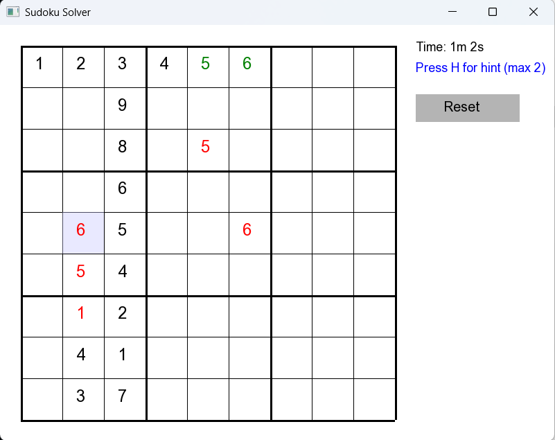

# 🎮 Sudoku Solver Game (SFML + C++)

A feature-rich Sudoku game built using **C++** and **SFML**, offering an interactive grid, difficulty levels, error feedback, a hint system, timer, and reset functionality — all in a clean, minimal GUI.

---

## 🚀 Features

- ✅ **Difficulty Selection**: Choose between **Beginner** (error-marking) and **Expert** (strict input).
- ✅ **Hint System**: Press `H` to reveal a correct number (max 2 hints per game).
- ✅ **Error Detection**: Invalid entries are automatically marked in **red** (Beginner mode).
- ✅ **Hint Highlighting**: Hinted cells appear in **green** and are **non-editable**.
- ✅ **Timer**: Displays elapsed time for your current session.
- ✅ **Reset Button**: Reset the game state at any time to try again.

---

## 📸 Preview

>   
> _Sudoku Game UI with highlighted cells, timer and hint info._

---

## 🧩 How to Play

1. **Run the game** and select a difficulty mode from the terminal.
2. **Click** on a cell to select it.
3. **Type a digit (1–9)** to fill the cell:
   - Beginner: Mistakes are marked in red.
   - Expert: Invalid entries are blocked.
4. Press `H` (max twice) to get a **correct number hint**.
5. Click **Reset** to clear the board and start again.
6. Track your time in the top-right corner!

---

## 🛠️ Requirements

- C++17 or later
- [SFML 2.6+](https://www.sfml-dev.org/)
- CMake (for build configuration)

---

## 🏗️ Build Instructions

```bash
# Clone the repo
git clone https://github.com/Akshat-Priyadarshi/Web_Dev-Projects/edit/main/Sudoku_Game.git
cd Sudoku_Game

# Create a build directory
mkdir build && cd build

# Run CMake to generate Makefiles
cmake .. -G "MinGW Makefiles"

# Build the executable
mingw32-make .

```

## 📁 Project Structure

```css
Sudoku_Game/
├── assets/
│   └── fonts/
│       └── arial.ttf
├── include/
│   ├── UI.hpp
│   ├── Solver.hpp
│   └── common.hpp
├── src/
│   ├── main.cpp
│   ├── UI.cpp
│   └── Solver.cpp
├── CMakeLists.txt
└── README.md
```

## 🙌 Acknowledgements

- Built using SFML
- Inspired by traditional Sudoku Logic games

## 📃 License

This project is licensed under the MIT License. Feel free to use, modify, and distribute it.

## 👨‍💻 Author

Akshat Priyadarshi
